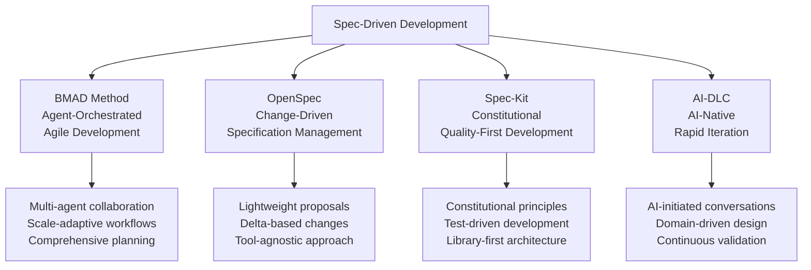
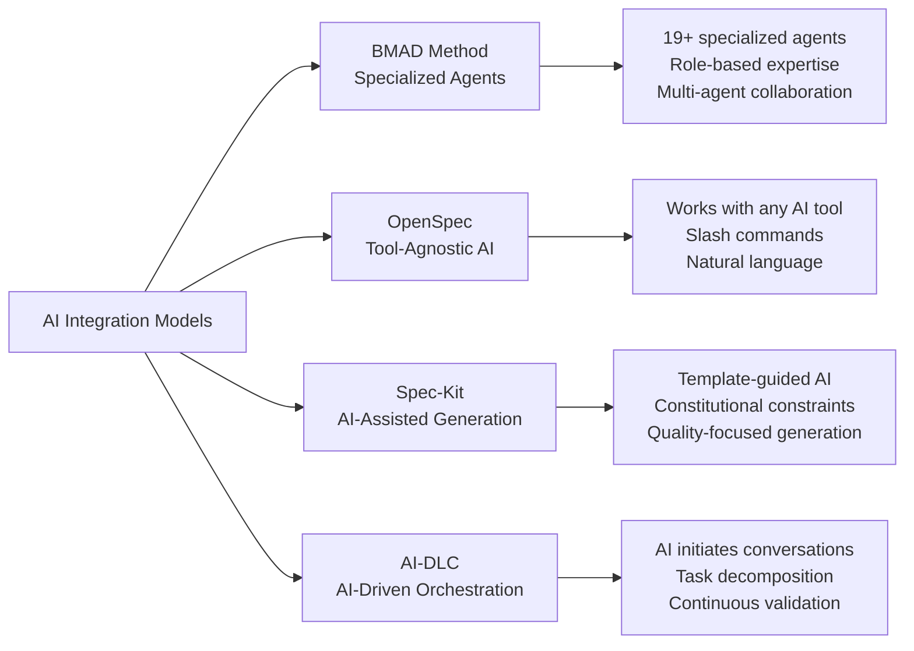

# Spec-Driven Development Approaches: A Comparative Analysis

**A comprehensive evaluation of BMAD Method, OpenSpec, Spec-Kit, and AI-DLC**

---

## Executive Summary

Spec-driven development (SDD) represents a fundamental shift in software engineering, where specifications become executable artifacts that drive implementation rather than merely documenting it. This white paper analyzes four leading approaches to SDD, each offering distinct philosophies and methodologies for leveraging AI in the development lifecycle.

### Key Findings

- **BMAD Method** excels in comprehensive project management with adaptive complexity scaling
- **OpenSpec** provides lightweight, change-focused workflows with excellent tool integration
- **Spec-Kit** offers structured, constitutional development with strong quality gates
- **AI-DLC** pioneers AI-first methodology with rapid iteration cycles

### Recommendations

- **For Enterprise Teams**: BMAD Method or AI-DLC depending on AI maturity
- **For Agile Teams**: OpenSpec for its lightweight change management
- **For Quality-Focused Teams**: Spec-Kit for its constitutional approach
- **For AI-Native Teams**: AI-DLC for cutting-edge AI collaboration

---

## Introduction

The software development industry is experiencing a paradigm shift. Traditional code-first approaches are giving way to specification-driven methodologies that leverage artificial intelligence to bridge the gap between intent and implementation. This transformation addresses long-standing challenges in software development: maintaining alignment between requirements and code, managing complexity at scale, and accelerating delivery without sacrificing quality.

Four distinct approaches have emerged as leaders in this space, each with unique philosophies and implementations:

1. **BMAD Method** - Comprehensive agile development with AI agents
2. **OpenSpec** - Lightweight change-driven specification management
3. **Spec-Kit** - Constitutional development with quality gates
4. **AI-DLC** - AI-native development lifecycle methodology

This analysis provides decision-makers with the insights needed to select the approach that best fits their organizational context, technical requirements, and development culture.

---

## Methodology Comparison Framework

Our analysis evaluates each approach across three primary dimensions:

### Strategic Dimensions
- Methodology Philosophy
- Target Audience & Use Cases  
- Workflow Complexity
- AI Integration Model
- Scalability & Adaptability
- Tool Ecosystem

### Technical Dimensions
- Architecture Pattern
- State Management
- Integration Approach
- Quality Gates
- Extensibility
- Technical Maturity

### User Experience Dimensions
- Onboarding Experience
- Daily Workflow
- Collaboration Model
- Change Management
- Documentation Quality
- Community & Support

---

## Comparative Analysis

### Methodology Philosophy

**BMAD Method** adopts a comprehensive agent-orchestrated approach where specialized AI agents collaborate across the entire development lifecycle. It emphasizes scale-adaptive workflows that automatically adjust complexity based on project requirements.

**OpenSpec** focuses on change-driven specification management, treating specifications as living documents that evolve through explicit change proposals. It maintains a clear separation between current state (specs) and proposed changes.

**Spec-Kit** implements a constitutional approach with immutable development principles that govern all generated code. It emphasizes quality gates and test-driven development as core methodology components.

**AI-DLC** pioneers an AI-native approach where AI initiates and directs conversations with humans, reversing traditional interaction patterns. It integrates domain-driven design principles directly into the core methodology.

### Target Audience & Use Cases

| Approach | Primary Audience | Ideal Use Cases | Project Scale |
|----------|------------------|-----------------|---------------|
| **BMAD Method** | Enterprise teams, Product organizations | Complex products, Multi-feature platforms, Brownfield enhancement | Small to Enterprise |
| **OpenSpec** | Agile teams, Cross-platform developers | Feature additions, API changes, Iterative development | Small to Large |
| **Spec-Kit** | Quality-focused teams, Regulated industries | Greenfield development, High-quality systems, Compliance requirements | Medium to Large |
| **AI-DLC** | AI-native teams, Innovation labs | Rapid prototyping, Complex systems, AI-first organizations | Medium to Enterprise |

### Workflow Complexity

**Learning Curve Analysis:**

- **BMAD Method**: Moderate to High - Comprehensive agent system requires understanding of roles and workflows
- **OpenSpec**: Low to Moderate - Simple change proposal model with clear stages
- **Spec-Kit**: Moderate - Constitutional principles and TDD approach need initial learning
- **AI-DLC**: High - New paradigm requires significant mindset shift

**Ceremony Level:**

- **BMAD Method**: Adaptive - Scales from minimal (Quick Flow) to comprehensive (Enterprise)
- **OpenSpec**: Minimal - Lightweight proposal and implementation cycle
- **Spec-Kit**: Moderate - Structured phases with quality gates
- **AI-DLC**: Variable - Depends on project complexity and AI capability

### AI Integration Model

---

## Feature Comparison Matrix

| Feature | BMAD Method | OpenSpec | Spec-Kit | AI-DLC |
|---------|-------------|----------|----------|---------|
| **Multi-Agent Support** | ✅ Native (19+ agents) | ⚠️ Tool-dependent | ⚠️ Single AI model | ✅ AI-orchestrated |
| **Scale Adaptability** | ✅ 3 tracks (Quick/Method/Enterprise) | ⚠️ Manual scaling | ⚠️ Single approach | ✅ Adaptive planning |
| **Change Management** | ⚠️ Story-based | ✅ Delta-based proposals | ⚠️ Version-based | ⚠️ Iteration-based |
| **Tool Integration** | ⚠️ IDE-focused | ✅ 25+ platforms | ⚠️ AI assistant dependent | ⚠️ Platform-specific |
| **Quality Gates** | ✅ Implementation readiness | ✅ Validation commands | ✅ Constitutional gates | ✅ Continuous validation |
| **Documentation** | ✅ Comprehensive | ✅ Good | ✅ Excellent | ⚠️ Academic focus |
| **Brownfield Support** | ✅ Document-project workflow | ✅ Change proposals | ⚠️ Limited | ✅ Code elevation |
| **Test Integration** | ✅ TEA agent + workflows | ⚠️ Manual | ✅ TDD mandatory | ✅ Automated generation |
| **Customization** | ✅ Agent personalities + modules | ⚠️ Limited | ⚠️ Template-based | ⚠️ Framework-bound |
| **Community** | ✅ Active Discord | ✅ Growing | ✅ GitHub-based | ⚠️ Academic/AWS |

**Legend:**
- ✅ Strong support/native feature
- ⚠️ Limited support/requires workarounds
- ❌ Not supported/significant limitations

---

## Architecture Patterns

### State Management Approaches

### Integration Patterns

**BMAD Method**: Deep IDE integration with agent-based workflows
**OpenSpec**: Universal tool integration through slash commands and AGENTS.md
**Spec-Kit**: AI assistant integration with template-driven generation
**AI-DLC**: Platform-specific integration with orchestration tools

---

## Strengths and Limitations

### BMAD Method
**Strengths:**
- Comprehensive agent ecosystem with specialized expertise
- Scale-adaptive workflows (Quick Flow to Enterprise)
- Strong brownfield support with document-project
- Active community and extensive documentation
- Modular architecture with custom module support

**Limitations:**
- High learning curve for full methodology
- IDE-dependent (though supports many)
- Complex agent coordination for simple tasks
- Requires understanding of agent roles and capabilities

### OpenSpec
**Strengths:**
- Lightweight and tool-agnostic approach
- Excellent change management with delta tracking
- Broad platform support (25+ tools)
- Clear separation of current state vs proposals
- Simple three-stage workflow

**Limitations:**
- Limited built-in AI agent support
- Manual scaling for complex projects
- Requires discipline for change proposal creation
- Less guidance for architectural decisions

### Spec-Kit
**Strengths:**
- Strong constitutional framework ensuring quality
- Mandatory test-driven development
- Excellent template-guided AI generation
- Clear quality gates and validation
- Library-first architecture principles

**Limitations:**
- Single AI model dependency
- Limited brownfield support
- Rigid constitutional constraints may limit flexibility
- Smaller community and ecosystem

### AI-DLC
**Strengths:**
- Pioneering AI-native methodology
- Rapid iteration cycles (hours/days)
- Domain-driven design integration
- Continuous AI validation
- Academic rigor and research backing

**Limitations:**
- Requires significant paradigm shift
- Limited tooling ecosystem
- Academic focus may not suit all teams
- High dependency on AI capability maturity

---

## Decision Framework

### Choose BMAD Method When:
- Building complex products or platforms
- Need comprehensive agent collaboration
- Working with brownfield codebases
- Require scale-adaptive workflows
- Team values extensive documentation and community

### Choose OpenSpec When:
- Need lightweight change management
- Working across multiple development tools
- Prefer minimal ceremony and overhead
- Focus on iterative feature development
- Value tool-agnostic approaches

### Choose Spec-Kit When:
- Quality and testing are paramount
- Building greenfield applications
- Need constitutional development principles
- Prefer structured, template-driven approaches
- Working in regulated industries

### Choose AI-DLC When:
- Embracing AI-native development
- Need rapid iteration capabilities
- Building complex, domain-rich systems
- Team is comfortable with paradigm shifts
- Organization supports cutting-edge methodologies

---

## Implementation Recommendations

### Pilot Project Approach
1. **Start Small**: Begin with a non-critical project to learn the methodology
2. **Measure Impact**: Track development velocity, quality metrics, and team satisfaction
3. **Iterate**: Refine the approach based on team feedback and results
4. **Scale Gradually**: Expand to larger projects as expertise grows

### Team Preparation
- **Training**: Invest in methodology-specific training for development teams
- **Tooling**: Ensure proper tool setup and integration
- **Culture**: Prepare for workflow and mindset changes
- **Support**: Establish internal champions and support structures

### Success Metrics
- **Development Velocity**: Time from specification to deployment
- **Quality Metrics**: Bug rates, test coverage, architectural consistency
- **Team Satisfaction**: Developer experience and adoption rates
- **Business Impact**: Feature delivery speed and stakeholder satisfaction

---

## Future Outlook

The spec-driven development landscape is rapidly evolving, with each approach contributing unique innovations:

- **BMAD Method** is expanding its agent ecosystem and module architecture
- **OpenSpec** is developing experimental workflows and enhanced tooling
- **Spec-Kit** is refining its constitutional framework and AI integration
- **AI-DLC** is pioneering new AI-native development patterns

Organizations should consider not just current capabilities but also the trajectory and innovation pace of each approach when making long-term decisions.

---

## Conclusion

Spec-driven development represents a fundamental shift in how we build software, and each of the four approaches analyzed offers distinct advantages for different organizational contexts. The choice between BMAD Method, OpenSpec, Spec-Kit, and AI-DLC should be based on team size, project complexity, quality requirements, and organizational readiness for AI-native development.

Success with any approach requires commitment to the methodology, proper tooling setup, and team training. Organizations that embrace spec-driven development early will likely gain significant competitive advantages in development velocity, code quality, and ability to manage complex software systems.

The future of software development is specification-driven, and these four approaches provide proven pathways to that future.

---

## References

- BMAD Method Documentation: https://github.com/bmad-code-org/BMAD-METHOD
- OpenSpec Project: https://github.com/Fission-AI/OpenSpec  
- Spec-Kit Repository: https://github.com/github/spec-kit
- AI-DLC White Paper: AWS AI-Driven Development Lifecycle Method Definition

---

*This analysis was conducted through comprehensive examination of documentation, methodologies, and practical implementations of each approach. For the most current information, please refer to the official project repositories and documentation.*